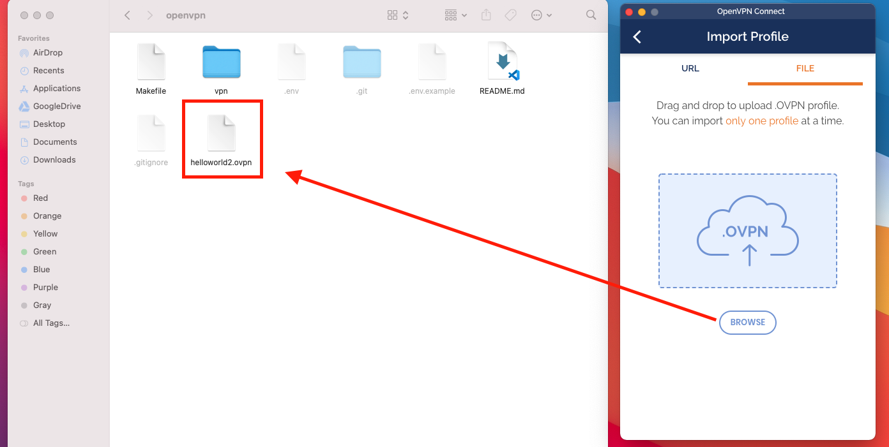

# Creating OpenVPN for Docker with Makefile

Tạo một OpenVPN server trong 3 phút.

Repo này chứa scipt để tạo VPN server nhanh chóng. Đối tượng hướng tới là các bạn chưa có nhiều kinh nghiệm set up server, do vậy phần Readme sẽ chứa nhiều hình ảnh minh hoạ.

Để thực hiện như hướng dẫn thì bạn cần tài khoản trên Digital Ocean. 
Register theo link phía sau để nhận được $100 in credit [Digital Ocean $5/mo node](https://m.do.co/c/6021fc433ba5)

#### Upstream Links

* Docker Registry @ [kylemanna/openvpn](https://hub.docker.com/r/kylemanna/openvpn/)
* GitHub @ [kylemanna/docker-openvpn](https://github.com/kylemanna/docker-openvpn)

## Quick Start

### 1. Tạo một node/droplet trên Digital Ocean
>
> Nhớ check chọn SSH Keys. 
> 

### 2. Copy .env từ **.env.example, thêm cấu hình cho phù hợp.
>

### 3. Mở Terminal lên run (make init) để tạo OpenVPN server.
>**Các thao tác là tự động, ngoại trừ việc nhập Pass Phrase**
>
>

### 4. Run (make client) để tạo client certificate (dạng file .ovpn). File này sau khi tạo xong thì chứa trong thư mục cùng cấp.
>

### 5. Do iOS không support OpenVPN nên cần dùng OpenVPN Connect để kết nối tới VPN server trước đó.
>

### File .ovpn cũng có thể mở trên iPhone với OpenVPN Connect